# Partake — Data Flow Architecture

> Receipt-scanning bill splitter with OCR, geolocation tax lookup, and payment deep links.

## Platform Summary

| Layer | Service |
|-------|---------|
| **Hosting** | Vercel (Next.js 16) |
| **Database** | Firebase Firestore (bills, users, contacts, partnerGroups) |
| **Auth** | Firebase Authentication (Google Sign-In + anonymous fallback, popup → redirect on iOS Safari) |
| **Storage** | Firebase Cloud Storage (receipt images) |
| **OCR** | Google Cloud Vision API (primary) + Tesseract.js (client fallback) |
| **Geolocation** | Browser Geolocation API + OpenStreetMap Nominatim (reverse geocoding) |
| **Tax Rates** | Hardcoded state table (Tax Foundation 2025) |
| **Payments** | Venmo, Cash App (deep links), Zelle (manual copy) |
| **Client Storage** | localStorage (last 50 bills, contacts, guest name) |

## Data Flow

```mermaid
flowchart TB
    subgraph Browser["🌐 Browser"]
        App["Next.js 16 SPA\nReact 19 + Tailwind"]
        LS["localStorage\n• partake_bills (50 max)\n• partake_contacts\n• guest_name"]
        Camera["📷 Camera / Gallery\nReceipt capture"]
    end

    subgraph Vercel["▲ Vercel"]
        API["Next.js API Route\n/api/ocr\n(server-side proxy)"]
    end

    subgraph Firebase["🔥 Firebase"]
        Firestore["Firestore\n• bills/{id}\n• users/{uid}/contacts\n• users/{uid}/partnerGroups"]
        FBAuth["Firebase Auth\n• Google Sign-In (popup/redirect)\n• Anonymous fallback\n• linkWithPopup upgrade"]
        FBStorage["Cloud Storage\n(Receipt images)"]
    end

    subgraph External["🔌 External APIs"]
        GoogleAuth["Google OAuth\naccounts.google.com"]
        Vision["Google Cloud Vision\nTEXT_DETECTION"]
        Tesseract["Tesseract.js\n(client-side fallback)"]
        Nominatim["OpenStreetMap Nominatim\nReverse geocoding"]
        GeoAPI["Browser Geolocation\nAPI"]
        TaxTable["Hardcoded Tax Table\nTax Foundation 2025"]
    end

    subgraph Payments["💰 Payment Deep Links"]
        Venmo["Venmo\nvenmo.com/{user}"]
        CashApp["Cash App\ncash.app/$tag"]
        Zelle["Zelle\n(manual clipboard)"]
    end

    Camera -->|"image data"| App
    App -->|"image upload"| API
    API -->|"TEXT_DETECTION\nrequest"| Vision
    Vision -->|"OCR text"| API
    API -->|"parsed items"| App
    App -.->|"fallback if\nVision fails"| Tesseract

    App -->|"request permission"| GeoAPI
    GeoAPI -->|"lat/lng"| Nominatim
    Nominatim -->|"state/city"| TaxTable
    TaxTable -->|"tax rate %"| App

    App <-->|"bills, contacts"| Firestore
    App <-->|"Google / anonymous"| FBAuth
    FBAuth <-->|"OAuth"| GoogleAuth
    App -->|"receipt photos"| FBStorage
    App -->|"offline cache"| LS

    App -->|"charge request\ndeep link"| Venmo
    App -->|"payment link"| CashApp
    App -->|"copy amount"| Zelle

    style Browser fill:#e8f4fd,stroke:#2196F3
    style Vercel fill:#f5f5f5,stroke:#000
    style Firebase fill:#fff8e1,stroke:#FFA000
    style External fill:#e8f5e9,stroke:#4CAF50
    style Payments fill:#fce4ec,stroke:#E91E63
```

## Key Data Flows

1. **Receipt Scan**: Camera → image → Vercel API proxy → Google Cloud Vision → parsed items → bill split UI
2. **Tax Lookup**: Browser geolocation → Nominatim reverse geocode → state → hardcoded tax rate applied
3. **Sign-In**: User taps Google Sign-In → `signInWithPopup` → falls back to `signInWithRedirect` on iOS Safari / blocked popups → anonymous guests can upgrade via `linkWithPopup` to preserve bill history
4. **Bill Sharing**: Bill saved to Firestore with shareCode → share link (with OG image) → guest opens → anonymous or Google auth
5. **Settlement**: Calculated split → deep link to Venmo/Cash App → payment outside app → items locked after payment request sent
6. **Offline**: Bills cached in localStorage (max 50) → contacts persisted locally
